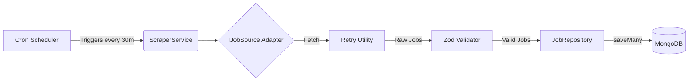

# 🏗️ Architecture & Ingestion Strategy

---

## 🕵️‍♂️ 1. Detection Surface

Real job platforms (like LinkedIn or Indeed) employ sophisticated techniques to detect and block automated bots. Some of the most common methods include:

- **Headless Browser Fingerprinting:** Checking properties like `navigator.webdriver === true`, missing browser plugins, unusual screen resolutions, or detecting WebGL/Canvas rendering mismatches.
- **Request Timing:** Bot requests often follow highly regular, predictable intervals (e.g., exactly every 2 seconds). Genuine human behavior involves random pauses and variable pacing.
- **Header Analysis:** Bots often miss necessary headers (like `Accept-Language` or `Referer`) or use generic user-agents (e.g., `axios/1.0`), which instantly flags them as non-browsers.
- **Behavioral Patterns:** Instant clicks right after page loads, zero mouse movement, or failing to interact with cookie consent banners.

### 🛡️ What My Design Handles
In `RemoteOkSource.source.js`, I implemented **basic header spoofing** by injecting a custom `User-Agent`. 

> **Honest Context:** I have *not* implemented advanced pacing, residential proxy rotation, or full browser automation. This is because my target demo sources are open public APIs that do not enforce aggressive anti-bot measures. Implementing those features right now would be over-engineering, but they are detailed in the "Future Work" section below.

---

## 📥 2. Ingestion Strategy

My current implementation relies on a "polite" ingestion approach:

- ⏳ **Polite Retry Pattern (`retry.util.js`):** The scraper uses exponential backoff. If a source fails, it doesn't aggressively hammer the endpoint. It waits and doubles the delay each time, letting the host recover.
- 🕒 **Scheduled Pacing:** Ingestion is orchestrated by a background cron scheduler running once every 30 minutes. This avoids continuous 24/7 polling and naturally paces the requests.

### 🚀 Future Work (For Hardened Platforms)
If I were targeting a heavily guarded platform, my strategy would evolve to include:
- **IP/Proxy Rotation:** Utilizing residential proxy networks (omitted here as public APIs don't require it).
- **Session/Cookie Management:** Retaining and rotating session cookies per identity to simulate returning users.
- **Randomized Jitter:** Introducing random delays between requests instead of fixed 30-minute intervals.

### 🔀 The Fallback Plan
Because I built everything around the `IJobSource` interface, if my primary source (RemoteOK) gets blocked, the system can automatically switch to `ArbeitnowSource`. Since both follow the exact same interface, swapping the source in the `ScraperService` requires absolutely **zero changes** to the underlying logic. This flexibility was the primary reason I chose this architecture.

---

## 🧱 3. Resilience

*Every stage of this pipeline fails independently — one bad job, one empty response, or one failed save doesn't take down the rest of the system.*

- ♻️ **Exponential Backoff:** Configured for 3 attempts with doubling delay to absorb transient network issues.
- 🔍 **Schema Validation (Zod):** If the API markup or response format suddenly changes, invalid records are silently skipped (returning `null`). The pipeline does not crash.
- 📭 **Empty Response Handling:** If the source returns nothing even after all retries, `ScraperService.js` logs a warning and gracefully returns `{ success: false, count: 0 }`.
- 🚧 **Partial Failure Isolation:** Inside `JobRepository.saveMany`, if a single job fails to save (e.g., due to a DB constraint), the rest of the batch continues saving without interruption.
- ⏱️ **Scheduler-Level Try/Catch:** If the entire scraper run crashes, the cron scheduler remains alive. The next scheduled run will execute normally 30 minutes later.

---

## ⚖️ 4. Ethical & Technical Line

I purposefully avoided scraping heavily protected platforms like LinkedIn or Indeed for this demo. Instead, I selected public APIs (RemoteOK, Arbeitnow) that are scraping-friendly and do not violate any Terms of Service.

**My Personal Stance:**
1. I will not bypass CAPTCHAs.
2. I will strictly respect `robots.txt`.
3. I will follow any explicitly stated rate limits from the source.

When building a real production system, my first choice is always to negotiate official partner APIs or license data from legal providers. Scraping is a last resort. If I absolutely had to scrape a protected site, I would enforce highly conservative rate limits to ensure we do not degrade the source's performance, and I would mandate a review by a legal team regarding the target's ToS before writing any code.

---

## 📊 5. Pipeline Architecture Diagram

